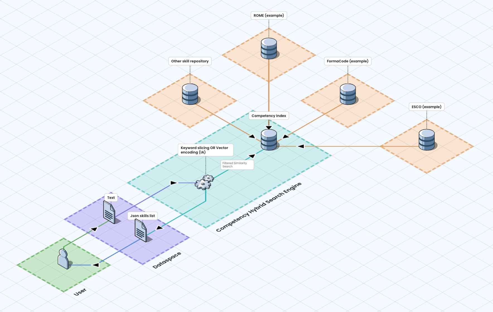
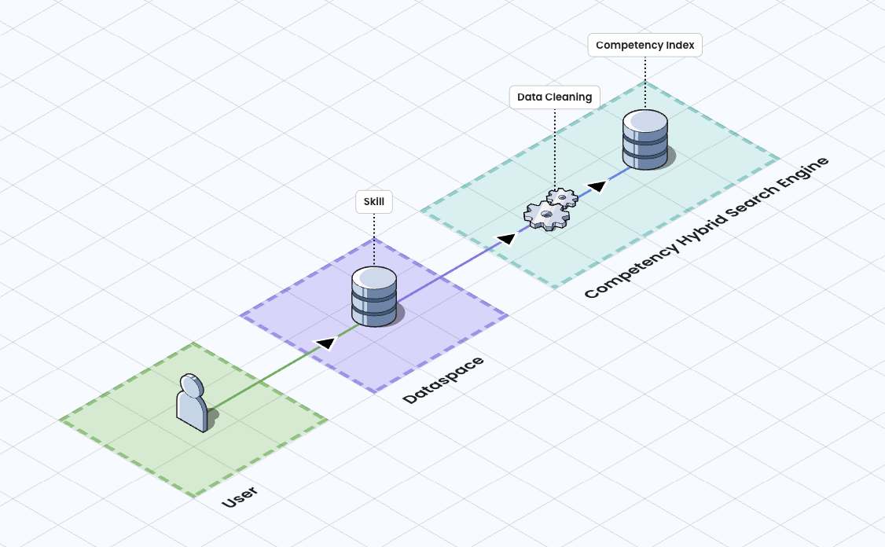
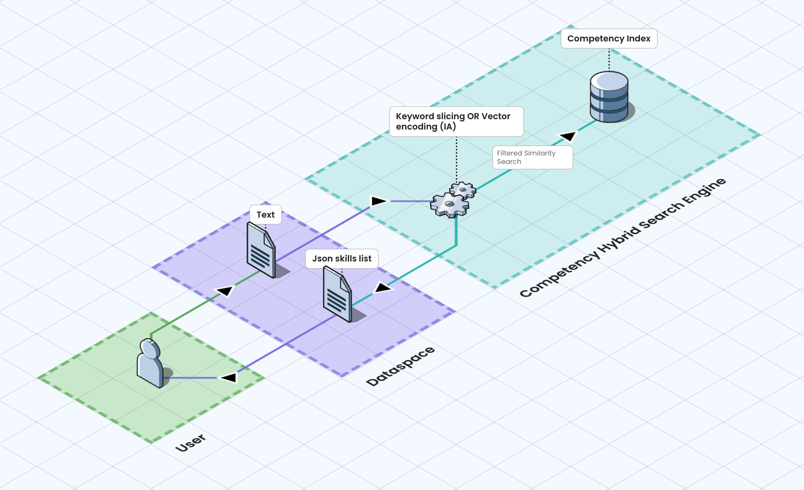

# Competency-Hybrid-Search-Engine

## Overview
Currently, multiple standards are used to express metadata related to educational resources, pedagogical activities, and training programs. These standards include formats such as LHEO (Langage harmonisé d'échange d'informations sur l'offre de formation) and LOM (Learning Object Metadata), which provide frameworks for detailing educational content. In addition to these metadata standards, there are several competency frameworks designed to categorize job skills and expertise areas. These frameworks include ROME (Répertoire Opérationnel des Métiers et des Emplois), Formacode, ESCO (European Skills, Competences, Qualifications and Occupations), EQF (European Qualifications Framework), and ECF (European Competence Framework).

Despite the availability of these standards and frameworks, the competency data contained within educational datasets are often poorly defined or inconsistently labeled. This ambiguity creates a major obstacle in effectively utilizing the datasets, especially when integrated into search engines. The lack of precise competency tagging can result in search outcomes that users find irrelevant or unhelpful, as seen with platforms like MonCompteFormation, where users struggle to find appropriate matches for their skill development needs.

To address these issues, Inokufu aims to develop a semantic similarity model based on machine learning. This model will systematically identify and categorize the skills, job roles, or training fields linked to specific educational resources and activities. By accurately mapping these competencies, the model will enhance the datasets' clarity and usability.

Ultimately, this improvement will increase the interoperability of educational datasets, enabling their seamless use across various competency-related applications. Additionally, the enhanced datasets will facilitate the effective integration and combination of different data sources and support informed impact studies in the field of education and workforce development.

## Objectives and expected outcomes
The objective of this building block is to specify and develop APIs type "parser" to analyze a text or keywords and suggest skills.
The primary goal of the **Competency Hybrid Search Engine** (CHSE) is to improve the quality of datasets concerning educational resources, pedagogical activities, and training programs by accurately adding or correcting the associated competency data. This includes job-related and domain-specific competencies critical for understanding and utilizing these educational materials effectively.

With the enhancement in skill identification, the metadata for training courses and learning objects will become standardized and aligned. This harmonization ensures that resources are consistently categorized using a unified skill framework, facilitating seamless communication across different datasets.
When educational resources and training materials are unified under a common skills taxonomy, interoperability between resources from various sources becomes feasible. This shared "skills language" allows for smoother integration and comparison of data, regardless of its origin.
As a result, search engines dedicated to training courses and educational resources will see significant improvements. They will be able to deliver more accurate and relevant search results, tailored specifically to meet user needs. This enhancement will not only improve user experience by providing more precise matches to their educational and professional development queries but also empower users to make more informed decisions based on comprehensive and comparable resource data.

## Approach
Recognizing that no single taxonomy can effectively work for every learner, we adopted a strategy focused on integration rather than creation. We offer the Domains of Competency Index (DCI) as a flexible meta-layer that maps and stores data from multiple skills, occupations and domain frameworks in a single repository. Powered by Artificial Intelligence and Natural Language Processing, the Inokufu DCI allows EdTech platforms to add, update, query and manage indexed data, accelerating the creation of next-generation learning tools.

The Competency Hybrid Search Engine (CHSE) is the most straightforward method to access information on skills, occupations, or knowledge domains through a single API. The system operates efficiently through two key processes:
- **Indexation**: When texts are submitted, our indexing system analyzes them to extract keywords and semantic embeddings using AI. It then stores these representations in a vector database.
- **Search**: Upon receiving a query, it is encoded and compared against the DCI Index to identify the best matches. Results are sorted by descending similarity score, ensuring that the most relevant data surfaces first.

Finally, the results are returned in a structured JSON format, providing an easily parsable output for seamless integration into various applications. This approach enhances information retrieval and supports effective decision-making processes.

### Indexation
To create a comprehensive skills index that incorporates the most widely used databases, a non-exhaustive analysis of the state of the art has been carried out. This analysis involved examining existing skills databases, taxonomies, and frameworks across various industries, regions and country to identify commonalities, gaps, and opportunities for integration.

The findings from this state-of-the-art review highlighted the fragmented nature of current skills databases, where multiple entities have developed their own taxonomies to categorize skills, occupations, and domains of knowledge. Despite their usefulness, these disparate systems often lack interoperability, making it challenging to integrate data across platforms and regions seamlessly.

In response to this challenge, Inokufu aims to develop an indexation pipeline, which will serve as a bridging solution. This indexation pipeline will leverage advanced techniques such as Natural Language Processing (NLP) and Artificial Intelligence (AI) to extract relevant information from the submitted skills.

The essential idea is that skills with similar meanings or applications, regardless of their origin, will produce vector that are close to each other in this new database. This proximity allows for the association of skills across different frameworks and databases, effectively breaking down the silos that currently exist. The development of such an indexing pipeline will empower educational technology companies, corporations, and individuals to access a unified skills landscape, enhancing collaboration and innovation in workforce development, education, and beyond.

To enhance this database, the CHSE will be equipped with an indexing service to integrate comprehensive skill data. The process begins with users submitting a skill. The next phase is dedicated to a thorough data verification to ensure that the information complies with the format of the Domains of Competency Index. This crucial step does not involve standardizing or correcting the data, as this must be done beforehand. However, we will provide a couple of examples on the conversion of a few well known standards. Once the data is verified for compliance with the required format, the service continues by integrating the skill into the Domains of Competency Index. This index is meticulously designed to categorize and organize skills in a manner that makes them not only easily searchable but also readily retrievable, thereby facilitating efficient access and utilization of skill data.

### Search
Once the input json is processed, its content is transformed into a vector. This vector is then compared against the existing data in the DCI. The system calculates the similarity between the input vector and the vectors of the skills in the index, identifying those that are most similar based on their distance in the vector space. This similarity is often measured using metrics such as cosine similarity or Euclidean distance, which calculate how closely related the input vector is to each skill vector.

After identifying the most relevant skills, the system retrieves a list of these skills and packages them in a structured JSON format. This JSON output includes suggested or tagged skills that relate closely to the input text, providing a clear and organized response that is easy for API users to incorporate into their applications or systems.

Data exchange :
- Input : json
- Output : json

Please refer to [this section](./README.md#example-usage) of the documentation for more information.

## Project status
Please note this project is work in progress.
- [x] State of the art of the latest evolutions of skills standards
- [x] Architecture of the project
- [ ] Development
  - [ ] Indexation pipeline (CRUD API to index competencies),
  - [ ] Semantic Search Engine of competencies,
- [ ] Test of the service, with skills datasets provided by Prometheus-X volunteer partners
- [ ] Development of automated service deployment scripts for multi-cloud use (infrastructure as code e.g. Kubernetes) at partner cloud providers 
- [ ] Drafting of the final public documentation

## Roadmap
Here are the key milestones of the project:
- 2025 Q2: Start of development of the CHSE
- 2025 Q3: Launch V0 of the CHSE
- 2025 Q4: Test with volunteer partners, Launch V1 of the CHSE

## Setup and installation
Please refer to [this section](./README.md#setup-and-installation) of the documentation.

## Contribution guidelines
We welcome and appreciate contributions from the community! There are two ways to contribute to this project:
- If you have a question or if you have spotted an issue or a bug, please start a new issue in this repository.
- If you have a suggestion to improve the code or fix an issue, please follow these guidelines:
    - **Fork the Repository**: Fork the CHSE repository to your own GitHub account.
    - **Create a Branch**: Make a new branch for each feature or bug you are working on.
    - **Make your Changes**: Implement your feature or bug fix on your branch.
    - **Submit a Pull Request**: Once you've tested your changes, submit a pull request against the CHSE's main branch.
Before submitting your pull request, please ensure that your code follows our coding and documentation standards. Don't forget to include tests for your changes!

## Interoperability of domain of competency : state-of-the-art in 2025
As a preparatory work for the development of the CHSE, Inokufu has conducted an exhaustive state of the art and quantitative study about the interoperability of Domain of Competency.

## References
https://gaia-x.eu/gaia-x-framework/  
https://prometheus-x.org/
